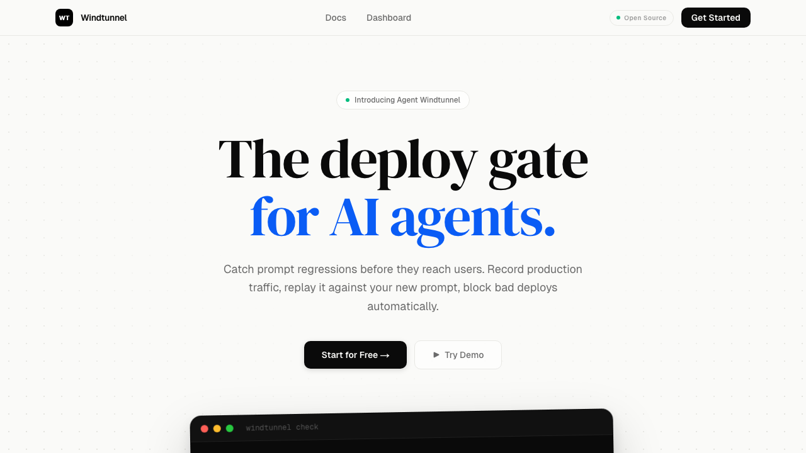
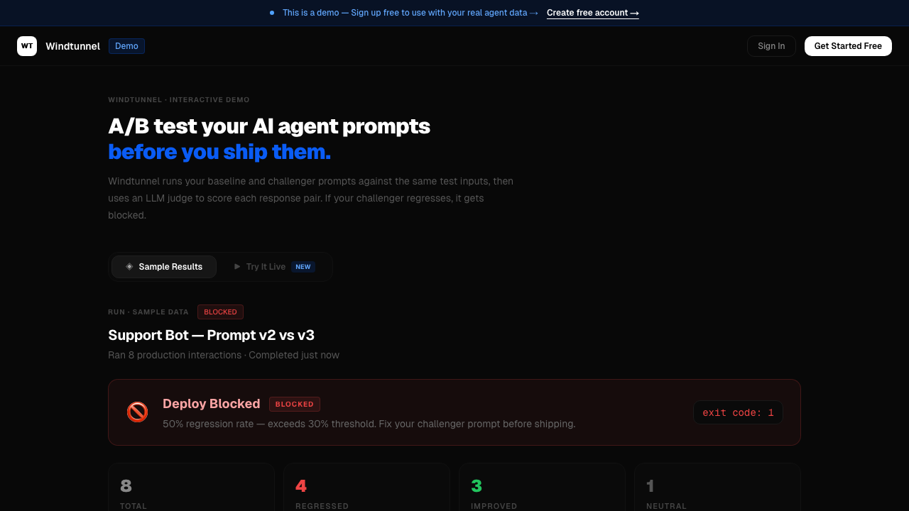
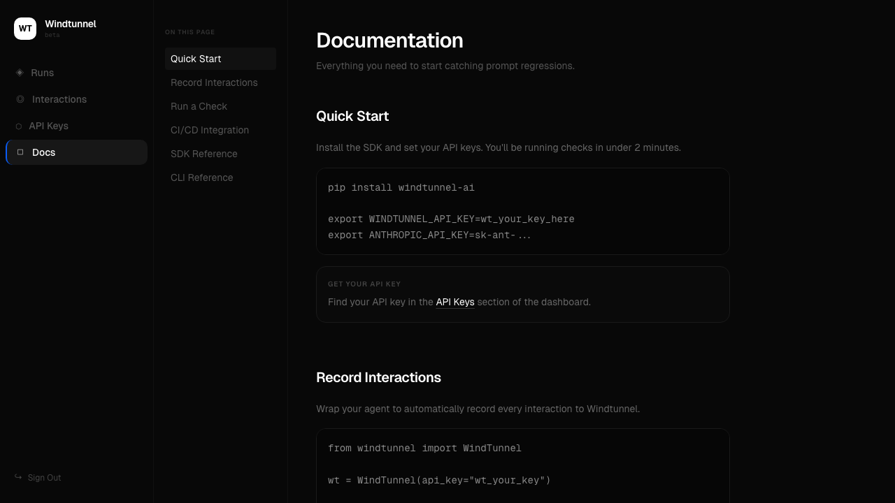

# Windtunnel

**The deploy gate for AI agents.**

Catch prompt regressions before they reach your users. Record production traffic, replay it against your new prompt, and block bad deploys automatically.



---

## Why Windtunnel?

When you change a system prompt, you have no idea if it's better or worse until users complain. Windtunnel fixes that:

1. **Record** — wrap your agent to log every production interaction
2. **Replay** — before deploying, run those interactions through both the old and new prompt
3. **Judge** — Claude scores each response pair: `better`, `worse`, or `neutral`
4. **Block** — if the regression rate exceeds your threshold, the deploy is blocked automatically

```
🌪️  Windtunnel check starting...
   Fetching 20 production interactions...
   Testing interaction 1/20...
   ...

🚫 DEPLOY BLOCKED — 60% regression rate (12/20 worse)
   View results: https://windtunnel-six.vercel.app/run/abc-123
```

---

## Screenshots

| Landing | Demo |
|---------|------|
|  |  |



---

## Quick Start

### 1. Install the SDK

```bash
pip install windtunnel-ai
```

### 2. Record interactions from your production agent

```python
from windtunnel import WindTunnel

wt = WindTunnel(api_key="wt_your_key")

# Wrap your agent — record every interaction
response = your_agent.run(user_message)

wt.record(
    user_input=user_message,
    agent_output=response,
    prompt_version="v1"
)
```

### 3. Run a regression check before deploying

```python
result = wt.run_windtunnel(
    baseline_prompt=CURRENT_PROMPT,
    challenger_prompt=NEW_PROMPT,
    n_interactions=20,
    anthropic_api_key="sk-ant-...",
    run_name="v2 prompt change"
)

if result["verdict"] == "BLOCKED":
    print(f"Deploy blocked — {result['regression_rate']}% regression rate")
    exit(1)
```

---

## CI/CD Integration

Automatically block bad prompt changes in GitHub Actions:

```yaml
name: Windtunnel Check

on:
  pull_request:
    paths:
      - 'prompts/**'

jobs:
  windtunnel:
    runs-on: ubuntu-latest
    steps:
      - uses: actions/checkout@v4

      - name: Run Windtunnel regression check
        run: |
          pip install windtunnel-ai
          windtunnel check \
            --baseline-version v1 \
            --challenger-prompt prompts/v2.txt \
            --n-interactions 20 \
            --fail-on-regression
        env:
          WINDTUNNEL_API_KEY: ${{ secrets.WINDTUNNEL_API_KEY }}
          ANTHROPIC_API_KEY: ${{ secrets.ANTHROPIC_API_KEY }}
```

---

## How the judge works

Windtunnel uses **Claude Haiku** as an LLM-as-judge. For each interaction it receives:
- The baseline output (current production prompt's response)
- The challenger output (new prompt's response)

And returns one of:
- `better` — challenger improved the response
- `worse` — challenger regressed the response
- `neutral` — no meaningful difference

If `worse / total > threshold` (default **30%**), the run verdict is `BLOCKED`.

---

## Python SDK Reference

```python
from windtunnel import WindTunnel

wt = WindTunnel(api_key="wt_...")

# Record a production interaction
wt.record(
    user_input="How do I reset my password?",
    agent_output="Go to Settings > Security > Reset Password...",
    prompt_version="v1",
    model="gpt-4o-mini",           # optional metadata
    metadata={"source": "prod"},   # optional
)

# Run a regression check
result = wt.run_windtunnel(
    baseline_prompt=CURRENT_PROMPT,
    challenger_prompt=NEW_PROMPT,
    n_interactions=20,             # how many recorded interactions to test
    baseline_version="v1",
    challenger_version="v2",
    run_name="My prompt change",
    anthropic_api_key="sk-ant-...",
)
# result = {
#   "verdict": "BLOCKED" | "APPROVED",
#   "regression_rate": 57.1,
#   "better": 3, "worse": 4, "neutral": 0,
#   "run_id": "uuid",
#   "results": [{ "score": "worse", "reasoning": "..." }, ...]
# }
```

---

## CLI Reference

```
windtunnel check [OPTIONS]

  --api-key TEXT              WindTunnel API key  [env: WINDTUNNEL_API_KEY]
  --anthropic-key TEXT        Anthropic API key   [env: ANTHROPIC_API_KEY]
  --baseline-version TEXT     Baseline prompt version to fetch  [required]
  --challenger-prompt TEXT    Path to challenger prompt file    [required]
  --n-interactions INTEGER    Number of interactions to test    [default: 10]
  --threshold FLOAT           Regression threshold              [default: 0.3]
  --fail-on-regression        Exit 1 if verdict is BLOCKED

windtunnel status             Verify connection and API key
```

---

## Demo scripts

Two end-to-end demos are included in `demo/`:

**Customer support agent** (`demo/demo_agent.py`)
- Records 5 real support interactions with a good prompt
- Tests a "simplified" lazy prompt as challenger
- Result: 🚫 BLOCKED — 80% regression rate

**Vibe coding agent** (`demo/vibe_coding_demo.py`)
- Tests a production-quality HTML generation prompt vs a lazy one
- Uses Claude Haiku to generate full websites for 7 test cases
- Result: 🚫 BLOCKED — 57% regression rate

```bash
cd demo
cp .env.example .env  # fill in PROJECT_API_KEY and ANTHROPIC_API_KEY
python vibe_coding_demo.py
```

---

## Project structure

```
windtunnel/
├── dashboard/          # Next.js app (live at windtunnel-six.vercel.app)
│   ├── app/
│   │   ├── api/        # REST API (interactions, runs, notify)
│   │   ├── dashboard/  # Run history
│   │   ├── run/[id]/   # Per-run detail view
│   │   ├── demo/       # Interactive demo (no signup needed)
│   │   └── docs/       # Documentation
│   └── lib/
│       ├── judge.ts    # LLM judge using Claude Haiku
│       └── supabase-server.ts
├── sdk/                # Python SDK — published to PyPI as windtunnel-ai
│   └── windtunnel/
│       ├── client.py   # WindTunnel class
│       └── cli.py      # windtunnel CLI
├── demo/               # End-to-end demo scripts
└── schema.sql          # Supabase schema
```

---

## Self-hosting

You'll need a Supabase project, Anthropic API key, and Resend API key.

1. Run `schema.sql` in the Supabase SQL editor
2. Deploy the `dashboard/` folder to Vercel
3. Set these environment variables in Vercel:

```
NEXT_PUBLIC_SUPABASE_URL=
NEXT_PUBLIC_SUPABASE_ANON_KEY=
SUPABASE_SERVICE_ROLE_KEY=
ANTHROPIC_API_KEY=
RESEND_API_KEY=
NOTIFY_EMAIL=           # receives blocked-deploy alerts
NEXT_PUBLIC_APP_URL=    # your deployed URL
```

---

## License

MIT — free to use, modify, and distribute.

---

Built with [Claude](https://anthropic.com) · [Next.js](https://nextjs.org) · [Supabase](https://supabase.com) · [Resend](https://resend.com)
