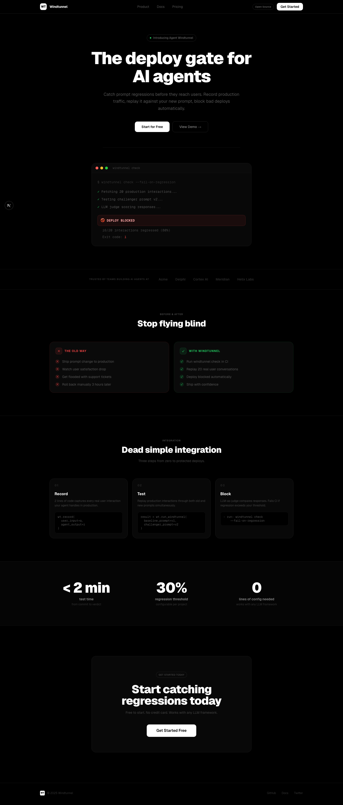
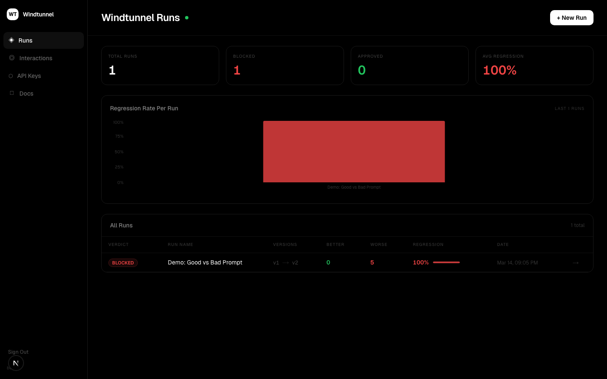
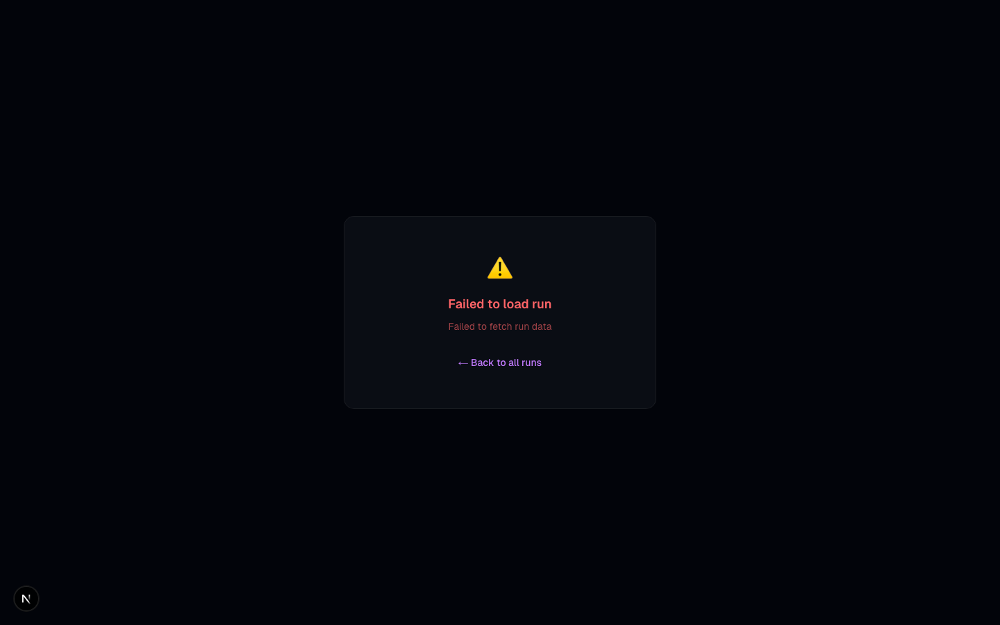
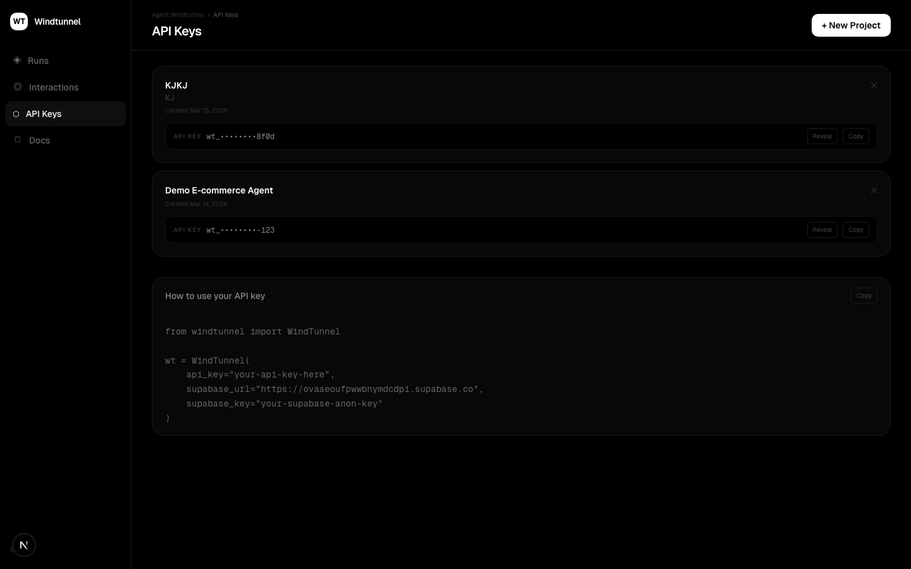
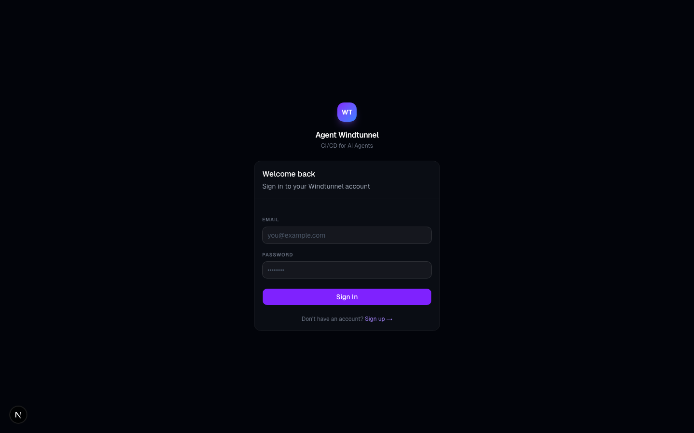

# Agent Windtunnel

**The deploy gate for AI agents.**

Windtunnel catches prompt regressions before they reach users. Record production traffic, replay it against your new prompt, and block bad deploys automatically — all in under 2 minutes.



---

## Why Windtunnel?

When you change a prompt, how do you know it's better? You can't A/B test forever, and you can't manually review thousands of conversations. Windtunnel solves this by:

1. **Recording** real user interactions from your production agent
2. **Replaying** them through your baseline and challenger prompts
3. **Judging** each response with Claude as an LLM-as-judge
4. **Blocking** the deploy if regression exceeds your threshold

```
🌪️  Windtunnel check starting...
   Fetching 20 production interactions...
   Testing interaction 1/20...
   ...

🚫 DEPLOY BLOCKED — 60% regression rate (12/20 worse)
   Run ID: abc-123
```

---

## Screenshots

| Dashboard | Run Detail |
|-----------|------------|
|  |  |

| API Keys | Login |
|----------|-------|
|  |  |

---

## Quick Start

### 1. Install the SDK

```bash
pip install windtunnel-ai
```

### 2. Record interactions from your agent

```python
from windtunnel import WindTunnel

wt = WindTunnel(api_key="wt_your_key")

# Wrap your agent — record every interaction
response = your_agent.run(user_message)

wt.record(
    user_input=user_message,
    agent_output=response,
    prompt_version="v1"
)
```

### 3. Run a regression check

```bash
export WINDTUNNEL_API_KEY=wt_your_key
export ANTHROPIC_API_KEY=sk-ant-...
export SUPABASE_SERVICE_KEY=your_service_key

windtunnel check \
  --baseline @prompts/v1.txt \
  --challenger @prompts/v2.txt \
  --n 20 \
  --fail-on-regression
```

---

## CI/CD Integration

Add to your GitHub Actions workflow to automatically block bad prompt deploys:

```yaml
name: Windtunnel Check

on:
  pull_request:
    paths:
      - 'prompts/**'

jobs:
  windtunnel:
    runs-on: ubuntu-latest
    steps:
      - uses: actions/checkout@v4

      - name: Install Windtunnel
        run: pip install windtunnel-ai

      - name: Run regression check
        run: |
          windtunnel check \
            --baseline @prompts/baseline.txt \
            --challenger @prompts/challenger.txt \
            --n 20 \
            --fail-on-regression
        env:
          WINDTUNNEL_API_KEY: ${{ secrets.WINDTUNNEL_API_KEY }}
          ANTHROPIC_API_KEY: ${{ secrets.ANTHROPIC_API_KEY }}
          SUPABASE_SERVICE_KEY: ${{ secrets.SUPABASE_SERVICE_KEY }}
```

---

## How It Works

```
Production Agent
      │
      ▼
wt.record(user_input, agent_output)   ← captures real conversations
      │
      ▼
Supabase (interaction store)
      │
      ▼
windtunnel check                      ← on every prompt change
      │
      ├── Replay through baseline prompt → baseline_output
      ├── Replay through challenger prompt → challenger_output
      └── Claude judges: better / worse / neutral
            │
            ▼
      regression_rate = worse / total
            │
      ≥ 30% → BLOCKED (exit 1)        ← CI fails, deploy blocked
      < 30% → APPROVED (exit 0)       ← safe to deploy
```

---

## Python SDK Reference

```python
from windtunnel import WindTunnel

wt = WindTunnel(
    api_key="wt_...",                  # from dashboard /api-keys
    anthropic_api_key="sk-ant-...",    # or ANTHROPIC_API_KEY env var
)

# Record a production interaction
wt.record(
    user_input: str,
    agent_output: str,
    prompt_version: str = "v1",
    model: str = "claude-haiku-4-5-20251001",
    metadata: dict = {},
    session_id: str = None             # auto-generated if not provided
)

# Run a comparison
result = wt.run_windtunnel(
    baseline_prompt: str,
    challenger_prompt: str,
    n_interactions: int = 10,
    baseline_version: str = "v1",
    challenger_version: str = "v2",
)
# Returns: { verdict, regression_rate, better, worse, neutral, run_id }
```

---

## CLI Reference

```
windtunnel check [OPTIONS]

  --api-key TEXT          WindTunnel API key  [env: WINDTUNNEL_API_KEY]
  --anthropic-key TEXT    Anthropic API key   [env: ANTHROPIC_API_KEY]
  --baseline TEXT         Baseline prompt or @file.txt  [required]
  --challenger TEXT       Challenger prompt or @file.txt  [required]
  --n INTEGER             Interactions to test  [default: 10]
  --fail-on-regression    Exit 1 if BLOCKED

windtunnel status         Verify connection and API key
```

---

## Project Structure

```
windtunnel/
├── dashboard/          # Next.js dashboard (deploy to Vercel)
│   ├── app/
│   │   ├── page.tsx           # Landing page
│   │   ├── dashboard/         # Runs overview
│   │   ├── run/[id]/          # Run detail + results
│   │   ├── interactions/      # Recorded interactions
│   │   ├── api-keys/          # Project & API key management
│   │   └── docs/              # Documentation
│   └── ...
├── sdk/                # Python SDK + CLI (pip install windtunnel-ai)
│   └── windtunnel/
│       ├── client.py          # WindTunnel class
│       └── cli.py             # windtunnel CLI
├── supabase/           # Database schema & migrations
└── docs/screenshots/   # Product screenshots
```

---

## Self-Hosting

### Dashboard (Vercel)

```bash
cd dashboard
vercel deploy
```

Set environment variables in Vercel:
- `NEXT_PUBLIC_SUPABASE_URL`
- `NEXT_PUBLIC_SUPABASE_ANON_KEY`

### Database (Supabase)

```bash
# Apply schema
psql $DATABASE_URL < schema.sql
```

---

## License

MIT — free to use, modify, and distribute.

---

## Contributing

PRs welcome. Open an issue first for large changes.

1. Fork the repo
2. Create a feature branch
3. Submit a PR with a clear description

---

Built with [Claude](https://anthropic.com) · [Next.js](https://nextjs.org) · [Supabase](https://supabase.com)
